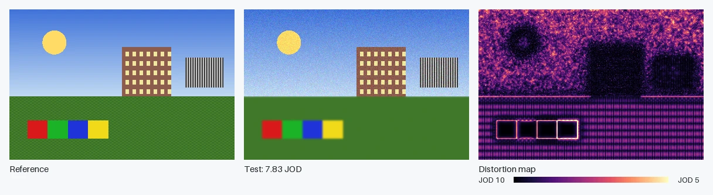
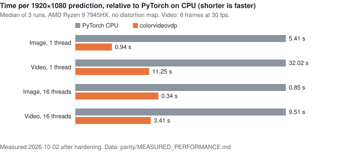
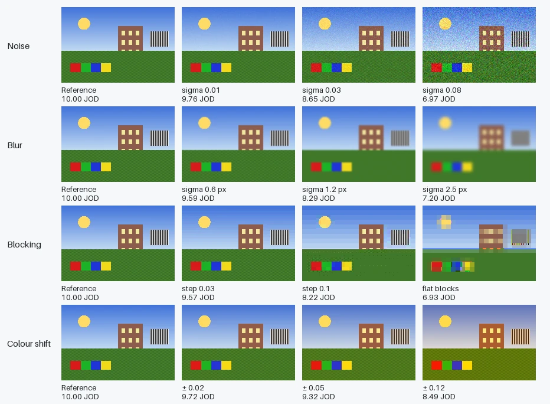
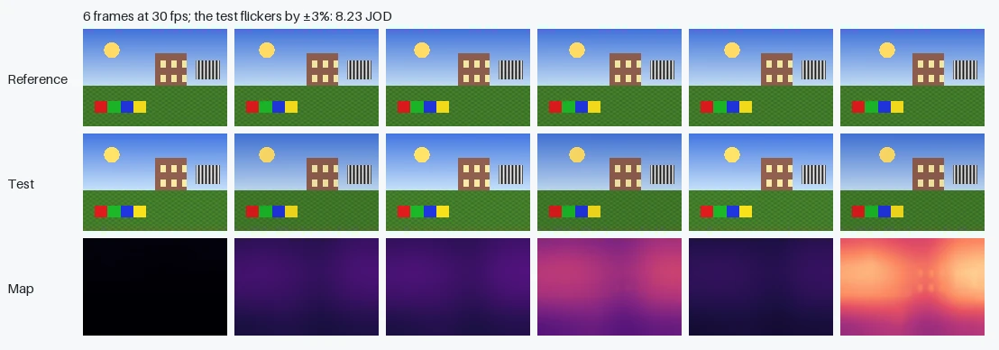

# colorvideovdp

[](https://crates.io/crates/colorvideovdp)
[](https://docs.rs/colorvideovdp)
[](https://github.com/Tavrin/colorvideovdp-rs/actions/workflows/ci.yml)
[](LICENSE)

A pure-Rust port of ColorVideoVDP, the full-reference image and video quality
metric by Mantiuk et al. (SIGGRAPH 2024). The authors call the metric `cvvdp`.
This crate implements the calibrated base model v0.5.7 and is validated against
the [official PyTorch implementation](https://github.com/gfxdisp/ColorVideoVDP)
at revision `2a268bc`. It is an independent port, not affiliated with the
original authors or the Graphics and Displays group at the University of
Cambridge.



*Reference, test (noise in the sky, blur on the ground) and the distortion map
computed by this crate for a 24-inch 1920 × 1080 display viewed from 0.6 m.
The test scores 7.83 JOD; brighter map pixels mean a more visible difference.*

**[Try it in your browser](https://tavrin.github.io/colorvideovdp-rs/)**:
compare two images with the WebAssembly build. Images stay on your machine.

## Why colorvideovdp

- A Rust implementation of ColorVideoVDP: no Python or PyTorch, one library
  that links into a Rust program or a single binary.
- Images and video, SDR and HDR (PQ, HLG, linear), on the 26 display models
  that ship with the reference, or on a custom display.
- Matches the PyTorch reference to within 0.00000286 JOD on a 150-case corpus
  and 0.00001383 JOD on a 500-case randomized sweep ([details](#parity)).
- Single-thread speedup over PyTorch on CPU: about 3.1× on the image
  workload and 3.0× on video ([details](#performance)).
- Builds for `wasm32-unknown-unknown`, and runs in the browser.
- No `unsafe` code; invalid input and oversized work return errors.

## Alternatives

- **[ColorVideoVDP](https://github.com/gfxdisp/ColorVideoVDP)** (PyTorch,
  `pip install cvvdp`) is the reference implementation by the metric's
  authors. Use it for GPU execution, batch evaluation from Python, video
  file input, the ML-based variants, colourized heatmaps and distograms,
  none of which this crate provides.
- **[FLIP](https://github.com/NVlabs/flip)** (Rust port:
  [flip-rs](https://crates.io/crates/flip-rs)) maps the difference a viewer
  sees when flipping between two rendered images. Use it for per-pixel error
  maps in rendering work; it has no temporal model and no JOD scale.
- **SSIM** ([dssim](https://crates.io/crates/dssim)) is a structural
  similarity score for images. Use it for image compression comparisons where
  display and viewing conditions do not matter.
- **[Butteraugli](https://crates.io/crates/butteraugli)** estimates
  perceived differences between images, and is used to tune JPEG XL and
  Guetzli. Use it for still-image codec work.
- **[VMAF](https://github.com/Netflix/vmaf)** predicts video quality for
  streaming encodes from features learned on viewer scores. Use it to compare
  encoder settings on SDR video, where it is widely used.

## Parity

150 cases, each compared against the PyTorch reference running on CPU:

| Corpus | Cases | Max absolute JOD error | Max raw map error | Max map error before f16 |
| --- | ---: | ---: | ---: | ---: |
| generated images | 42 | 0.00000095 | 0.00024408 | 0.00001842 |
| generated videos | 42 | 0.00000286 | 0.00097513 | 0.00001389 |
| other displays | 19 | 0.00000095 | 0.00010151 | 0.00000030 |
| colour spaces | 22 | 0.00000191 | 0.00023419 | 0.00012809 |
| temporal edges | 8 | 0.00000095 | 0.00024098 | 0.00000030 |
| spatial edges | 8 | 0.00000095 | 0.00011790 | 0.00000024 |
| grayscale | 3 | 0.00000000 | 0.00010574 | 0.00000089 |
| reference media | 6 | 0.00000095 | 0.00017059 | 0.00000089 |
| **Total** | **150** | **0.00000286** | **0.00097513** | **0.00012809** |

The acceptance thresholds are 0.01 JOD and 0.001 per map pixel. The corpus
covers noise, blur, shift, tone, block-quantization and flicker distortions on
all 26 embedded displays, all 22 colour spaces, the reference's example images,
2–30-frame sequences at 1–120 fps, and spatial and temporal edge cases. The
single-thread build and the 16-worker Rayon build produce identical results.

"Raw map error" is measured against the reference's public map, which is
quantized to f16. "Before f16" is measured against the reference's internal f32
map. The worst raw map error (HDR PQ flicker) equals that case's f16
quantization error in the reference.

A seeded 500-case randomized sweep adds extreme supported photometry and
high-fps cases; see the [sweep report](https://github.com/Tavrin/colorvideovdp-rs/blob/main/parity/results/sweep.md).

## Performance

Measured on 2026-10-02 with version 0.1.1. Rust
source and executable SHA-256 identities were captured at execution and are
stored with the samples in [the measurement record](parity/MEASURED_RESULTS.json).

Measured on an AMD Ryzen 9 7945HX (16 cores, 32 threads), 30 GiB RAM,
Linux x86_64; Rust 1.98.1 release build; PyTorch 2.14.1+cpu, Python 3.12.3.
Inputs are 1920 × 1080 f32 buffers, identical for both implementations, with
distortion maps off. Each figure is the median of five predictions after one
warm-up.



Single thread:

| 1080p workload | Rust (ms) | PyTorch CPU (ms) | PyTorch / Rust |
| --- | ---: | ---: | ---: |
| Image, noise | 737.93 | 2295.32 | 3.1× |
| Video, 8 frames at 30 fps, flicker | 9241.50 | 27338.51 | 3.0× |

Multi-threaded (16 Rayon workers; 16 PyTorch intra-op threads):

| 1080p workload | Rust (ms) | PyTorch CPU (ms) |
| --- | ---: | ---: |
| Image, noise | 200.88 | 665.19 |
| Video, 8 frames at 30 fps, flicker | 1990.17 | 8928.44 |

The parallel performance investigation records controlled before/after
samples, pipeline stage timings and bit-identity checks in
[parity/PARALLEL_PERFORMANCE.md](parity/PARALLEL_PERFORMANCE.md).

The reference is designed to run on a CUDA GPU; its CPU path is not the
authors' intended configuration. A GPU PyTorch run would be much faster than
either CPU figure here; it was not measured. These are wall-clock timings on a
shared machine and vary with load and thermal state. The method and raw samples
are in [parity harness](https://github.com/Tavrin/colorvideovdp-rs/tree/main/parity).

## What JOD means

ColorVideoVDP reports quality in Just-Objectionable-Difference (JOD) units.
10 JOD means no visible difference from the reference; lower values mean
stronger distortion, and very strong distortions can go below 0. A difference
of 1 JOD between two conditions means that 75% of observers would choose the
one with the higher score.



*Four distortions at three strengths each, scored by this crate on the same
display as above. Blocking keeps each 8 × 8 block's mean and quantizes the
deviations from it; "flat blocks" keeps only the mean.*

For video, the temporal channels respond to changes between frames. Here the
test sequence flickers by ±3% in brightness on alternate frames:



The figures are made by `examples/showcase.rs` and
[`docs/img/generate.py`](docs/img/README.md).

## Usage

```toml
[dependencies]
colorvideovdp = "0.1"
```

```rust
use colorvideovdp::{Color, Cvvdp, DisplayModel, Execution, Image, Options};

fn main() -> colorvideovdp::Result<()> {
    let reference = Image::new(64, 64, 3, vec![0.5; 64 * 64 * 3])?;
    let mut test = reference.clone();
    test.data_mut()[0] = 0.6;

    let display = DisplayModel::from_name("standard_4k")?;
    let options = Options::default()
        .with_distortion_map(true)
        .with_execution(Execution::SingleThread);
    let metric = Cvvdp::new(display, options)?;

    let image = metric.predict_image(&test, &reference, Color::Srgb)?;
    println!("image: {:.4} JOD", image.jod);

    let test_frames = vec![test; 8];
    let reference_frames = vec![reference; 8];
    let video = metric.predict_video(&test_frames, &reference_frames, 30.0, Color::Srgb)?;
    println!("video: {:.4} JOD", video.jod);
    Ok(())
}
```

`Image` owns one row-major, interleaved RGB or single-channel f32 frame. All
images in a prediction must have the same shape and finite samples. Decoding
image and video files, and removing alpha, is left to the caller.

`Color` selects the input encoding: `Color::Display` (the display's default),
`Srgb`, `Linear` (BT.709), `Pq` (BT.2020), `Hlg` (BT.2020), or any name from
`Color::names()` through `Color::Named`. Encoded inputs are clamped to [0, 1].
**Linear inputs are absolute luminance in cd/m²**, not relative [0, 1] RGB.

`Prediction` holds `jod`, the optional distortion map, the spatial band
frequencies, and the pooled per-channel features (the reference's `Q_per_ch`).
Images use three channels (achromatic, red–green, yellow–violet); videos add an
achromatic transient channel. A one-frame video takes the image path.

The `parallel` feature (default) enables `Execution::Parallel`, which splits
spatial rows across the current Rayon pool; results are identical to
`Execution::SingleThread`. Without the feature, the default is single-threaded
and requesting `Parallel` returns an error. The crate builds for
`wasm32-unknown-unknown` with default features off.

## Display models

The 26 display models of the reference `display_models.json` are embedded; see
`DisplayModel::names()`. A display defines resolution and pixels per degree,
peak luminance, contrast, ambient illuminance and panel reflectivity, exposure,
and a default colour space. Custom displays can be built from `Photometry` and
`Geometry` (fixed pixels per degree, physical size and viewing distance, or
diagonal field of view), or loaded with `DisplayModel::from_json` from a record
in the reference JSON format. The image size does not change the display
geometry: an image occupies its native pixel size on the display.

## Limits

- Images must be at least 4 × 4 pixels, with 1 or 3 channels.
- Temporal filters are capped at 4097 taps, so the frame rate must be in
  (0, 16384] fps.
- Prediction storage is checked against byte capacity and a conservative memory
  budget (default 1 GiB; `Options::with_memory_limit_bytes` changes it). The
  budget covers converted-frame caches, spatial/temporal working buffers and
  outputs, excluding caller-owned inputs, evaluator calibration, allocator
  overhead and Rayon worker stacks. Oversized layouts, budget excess and failed
  reservations return `SizeOverflow`, `MemoryLimitExceeded` and
  `AllocationFailed`, respectively.
- Supported photometry requires peak + intrinsic black + reflected ambient
  luminance ≤ 1,000,000 cd/m² and exposure ≤ 1,000,000. Configurations outside
  this domain return `InvalidDisplay`; they are rejected because f32 reference
  reductions can overflow and silently disagree with wider Rust accumulation.
- `Photometry` and `DisplayModel` are non-exhaustive; use their `new` constructors
  to create custom records. Public fields remain available for adjustment; the
  evaluator validates them when constructed.
- Distortion maps are kept in f32; the reference stores its public map as f16.
  Values are `1 - per_pixel_JOD / 10`, not clipped, with no colour map applied.
- f32 arithmetic is not bit-identical to PyTorch: PQ powers, convolutions, the
  inverse temporal FFT, and reductions round differently. The parity table
  gives the resulting error.
- The reference's boundary conventions are kept, including the horizontal
  pyramid reduction that uses height parity (in `lpyr_dec.py`) and the
  broadcast of single-channel input into all three sustained channels.
- Out of scope: the ML-based variants, video file readers, GPU execution,
  autograd, colourized heatmaps, and distograms.

## Development

```sh
cargo fmt --check
cargo clippy --all-targets --all-features -- -D warnings
cargo test --all-features
cargo test --no-default-features
cargo build --target wasm32-unknown-unknown --no-default-features
cargo run --example image
```

### Browser demo

`examples/web/` is a separate, unpublished package with the wasm-bindgen
bindings for the browser demo. To build and serve it locally, with
`wasm-bindgen-cli` at the version in `examples/web/Cargo.lock`:

```sh
cargo build --release --target wasm32-unknown-unknown --manifest-path examples/web/Cargo.toml
wasm-bindgen --target web --out-dir examples/web/pkg \
    examples/web/target/wasm32-unknown-unknown/release/colorvideovdp_web.wasm
python3 -m http.server --directory examples/web
```

The demo reads images as 8-bit sRGB on one thread. Its scores are not covered
by the parity records, which test native builds.

The minimum supported Rust version is 1.85. The tests include three small
fixtures produced by the reference, so they run without Python. The full parity
corpus and the benchmarks are reproduced with the unpublished harness in
[parity harness](https://github.com/Tavrin/colorvideovdp-rs/tree/main/parity), which needs a local checkout of the reference
and a CPU-only PyTorch environment.

## Licence

MIT, see [LICENSE](LICENSE). The licence keeps the copyright notice of the
original implementation (© 2024 Graphics and Displays group). The four JSON
files in `data/` (display models, colour spaces, model parameters, and the
castleCSF lookup table) are copied unchanged from the reference.

## Credit

ColorVideoVDP was developed by Rafał K. Mantiuk, Param Hanji, Maliha Ashraf,
Yuta Asano, and Alexandre Chapiro. Please cite their paper when you use the
metric in research:

> Rafał K. Mantiuk, Param Hanji, Maliha Ashraf, Yuta Asano, and Alexandre
> Chapiro. ColorVideoVDP: A visual difference predictor for image, video and
> display distortions. In SIGGRAPH 2024 Technical Papers, Article 129.
> <https://doi.org/10.1145/3658144>

```bibtex
@article{mantiuk2024colorvideovdp,
  author  = {Mantiuk, Rafa{\l} K. and Hanji, Param and Ashraf, Maliha and
             Asano, Yuta and Chapiro, Alexandre},
  title   = {{ColorVideoVDP}: A visual difference predictor for image, video
             and display distortions},
  journal = {ACM Transactions on Graphics},
  volume  = {43},
  number  = {4},
  articleno = {129},
  year    = {2024},
  doi     = {10.1145/3658144}
}
```

The project page is
<https://www.cl.cam.ac.uk/research/rainbow/projects/colorvideovdp/>.

This project is not affiliated with or endorsed by the authors or the
University of Cambridge.
